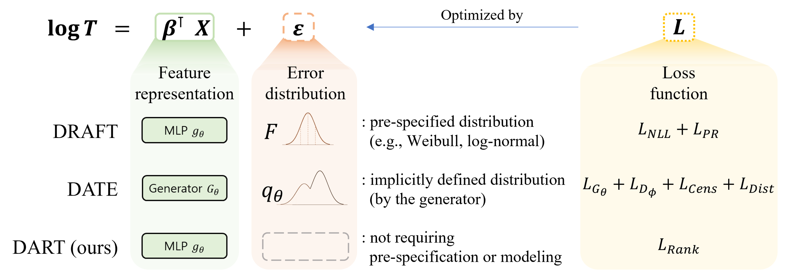

# Towards Flexible Time-to-event Modeling: Optimizing Neural Networks via Rank Regression (ECAI 2023)

This repository contains the implementation of the Deep AFT Rank-regression model for Time-to-event prediction (DART) of the paper **"Towards Flexible Time-to-event Modeling: Optimizing Neural Networks via Rank Regression"** by Authors: Hyunjun Lee*, Junhyun Lee*, Taehwa Choi, Jaewoo Kang and Sangbum Choi.
(* Equal contribution)



## Description
The code in this repository is used to perform survival analysis using a deep learning approach. It uses a variety of libraries such as PyTorch, lifelines, pandas, and numpy to preprocess the data, build the model, and evaluate its performance.


## Installation
To run the code, you will need to install the following Python libraries:

- numpy
- pandas
- pycox
- scikit-learn
- sklearn-pandas
- torch
- torchtuples
- lifelines
- wandb (optional)

You can install these libraries using pip:

```bash
pip3 install numpy pandas scikit-learn sklearn-pandas torch torchtuples lifelines pycox wandb
```


## Usage

Here is an example of how to run the script:

```bash
python DART_kkbox.py --dataset=kkbox_v1 --lr=1e-5 --num_layers=6 --num_nodes=256 --batch_size=1024 --use_BN --wandb
```


## Data

The script expects to find the data in a pickle file in the `./data/` directory. In case of KKBox, the data should be in the form of a pandas DataFrame with the following columns:

- `n_prev_churns`
- `log_days_between_subs`
- `log_days_since_reg_init`
- `age_at_start`
- `log_payment_plan_days`
- `log_plan_list_price`
- `log_actual_amount_paid`
- `is_auto_renew`
- `is_cancel`
- `strange_age`
- `nan_days_since_reg_init`
- `no_prev_churns`
- `city`
- `gender`
- `registered_via`

## Citation
TBA

## Contributing
Contributions are welcome. Please open an issue to discuss your ideas or submit a pull request with your changes.

## License
This project is licensed under the terms of the MIT license.


